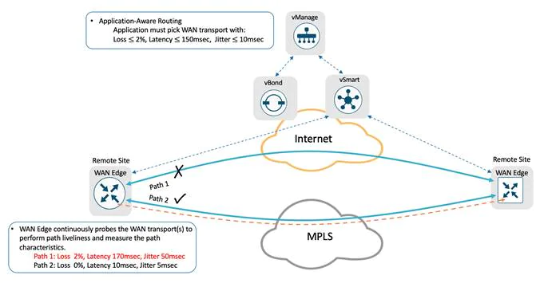
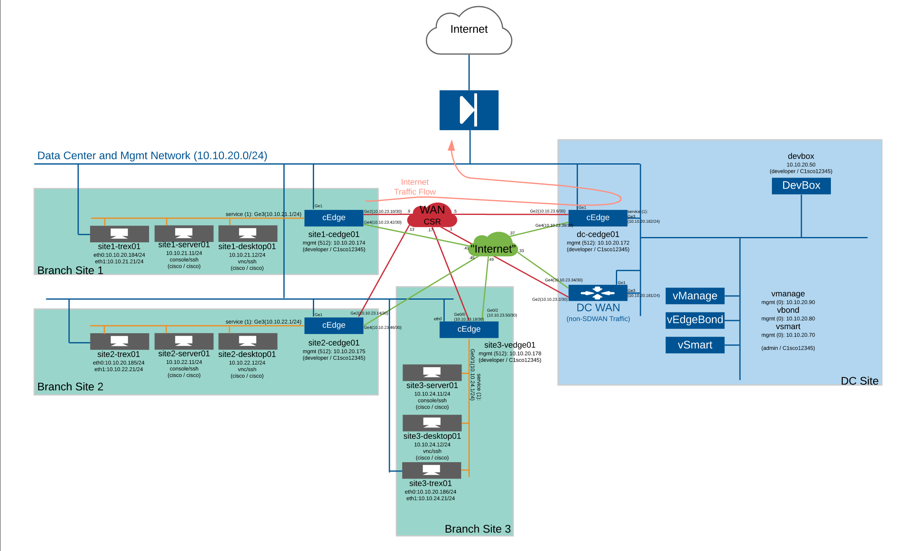
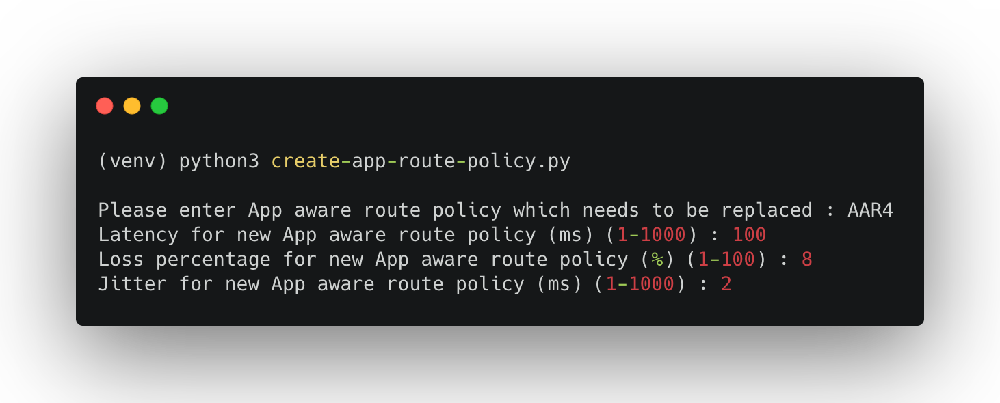
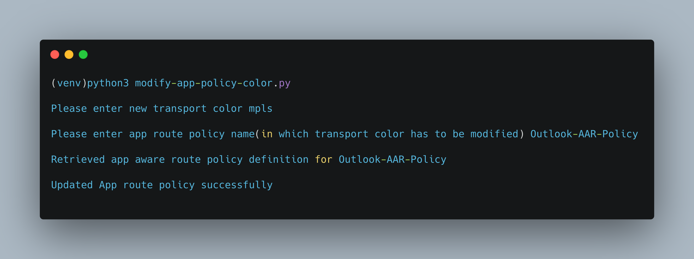
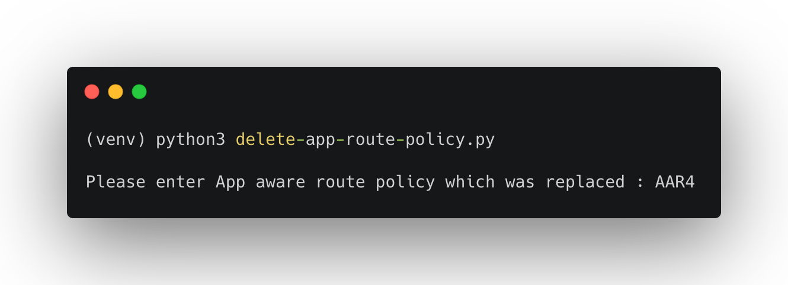
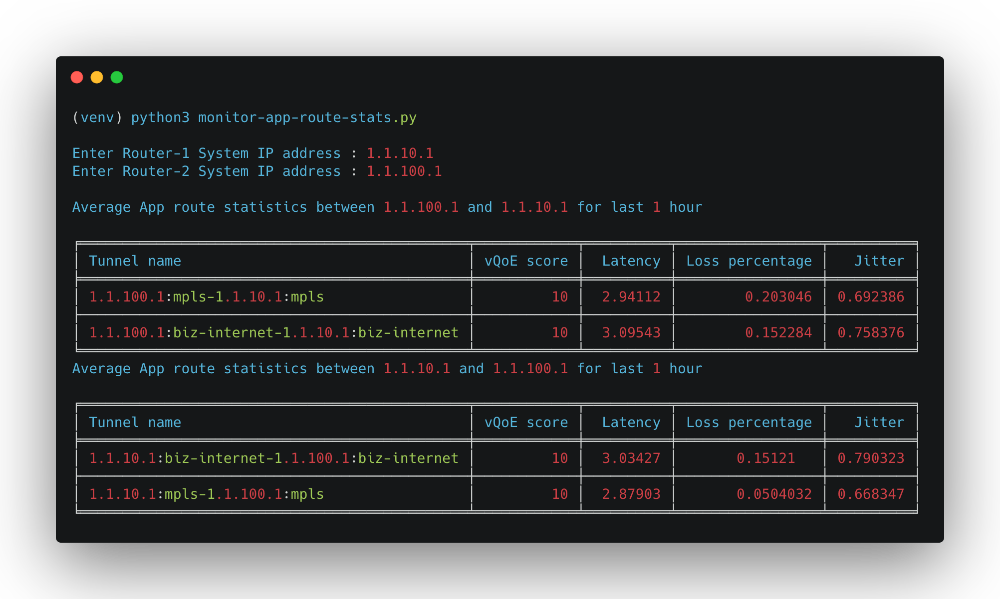

# Cisco SD-WAN Application Aware Routing Policies (AAR) Automation

Application-Aware Routing policy is configured in vManage as a centralized data policy that maps the service-side application(s) to specific SLA requirements. The centralized policies provisioned in vSmart controller are pushed to relevant WAN Edge devices for enforcement. The defined policy consists of match-action pairs. The match statement defines the applications on a list or the type of traffic to match, and the action statement defines the SLA action the WAN Edge devices must enforce for the specified traffic.

Cisco SD-WAN Application-Aware Routing consists of three components:
* Identification – Classify the traffic or application group of interest.
* Application SLA Requirement – Defining the application SLA requirements.
* Application-Aware Routing Policy – Policy maps the classified traffic to the transport tunnel based on the defined SLA requirement.

This python code that can be used to interact with the `Cisco SD-WAN vManage REST API`. You can edit the variables in the environment to point to your own vManage instance. The code contains REST API calls to authenticate, modify preferred color in Application Aware Routing policy.



## Objective

*   How to use vManage APIs
    - Create new SLA class list, Application Aware Routing policy and update active vSmart policy
    - Modify the preferred color in Application Aware Routing policy
    - Delete SLA class list and Application Aware Routing policy
    - Monitor Application Aware Routing statistics (BFD statistics) for Overlay Tunnels

## Requirements

To use this code you will need:

* Python 3.7+
* vManage user login details. (User should have privilege level to configure policies)

## Install and Setup

- Clone the code to local machine.

```
git clone https://github.com/sbarissonmez/sdwan-aar-policy-automation.git
cd sdwan-aar-policy-automation
```
- Setup Python Virtual Environment (requires Python 3.7+)

```
python3.7 -m venv venv
source venv/bin/activate
pip3 install -r requirements.txt
```

## Example:



### `Sample:` Create new SLA class list, Application Aware Routing policy and update active vSmart policy



### `Sample:` Modify preffered color in Application Aware Routing policy



- To modify the preferred color in Application Aware Routing policy, run the script using command `python modify-app-policy-color.py` on macOS/Ubuntu env or `py -3 modify-app-policy-color.py` on windows env

- Input value for the App route policy name is `Outlook-AAR-Policy`

- Possible input values for the new transport color are as below 

```
3g
biz-internet
blue
bronze
custom1
custom2
custom3
gold
green
lte
metro-ethernet
mpls
private1
private2
private3
private4
private5
private6
public-internet
red
silver
```

### `Sample:` Delete SLA class list and replaced Application Aware Routing policy



### `Sample:` Monitor average app route statistics 


