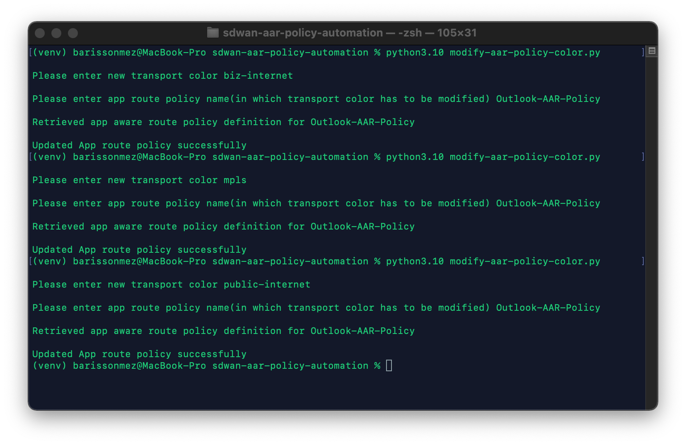

# Cisco SD-WAN vManage APIs for Application Aware Routing Policies

Application-aware routing tracks network and path characteristics of the data plane tunnels between Cisco SD-WAN devices and uses the collected information to compute optimal paths for data traffic. These characteristics include packet loss, latency, and jitter, and the load, cost and bandwidth of a link. The ability to consider factors in path selection other than those used by standard routing protocols—such as route prefixes, metrics, link-state information, and route removal on the Cisco SD-WAN device—offers a number of advantages to an enterprise:

* In normal network operation, the path taken by application data traffic through the network can be optimized, by directing it to WAN links that support the required levels of packet loss, latency, and jitter defined in an application’s SLA.

* In the face of network brownouts or soft failures, performance degradation can be minimized. The tracking of network and path conditions by application-aware routing in real time can quickly reveal performance issues, and it automatically activates strategies that redirect data traffic to the best available path. As the network recovers from the soft failure conditions, application-aware routing automatically readjusts the data traffic paths.

* Network costs can be reduced because data traffic can be more efficiently load-balanced.

* Application performance can be increased without the need for WAN upgrades.

This python code that can be used to interact with the `Cisco SD-WAN vManage REST API`. You can edit the variables in the environment to point to your own vManage instance. The code contains REST API calls to authenticate, modify preferred color in Application Aware Routing policy.


## Example:


- To modify the preferred color in Application Aware Routing policy, run the script using command `python3.10 modify-app-policy-color.py` on macOS/Ubuntu env or `py -3 modify-app-policy-color.py` on windows env

- Input value for the App route policy name is Outlook-AAR-Policy

- Possible input values for the new transport color are as below 

```
3g
biz-internet
blue
bronze
custom1
custom2
custom3
gold
green
lte
metro-ethernet
mpls
private1
private2
private3
private4
private5
private6
public-internet
red
silver
```
## Sample Outputs


